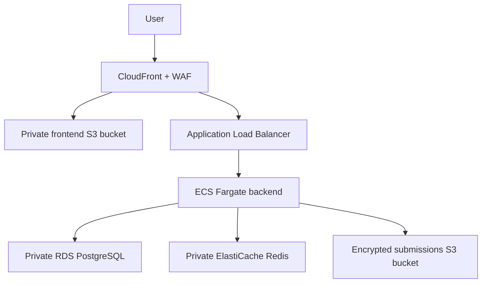

# Terraform AWS Three-Tier Platform

A secure, production-oriented three-tier application platform built on AWS with Terraform, Docker, ECS Fargate and GitHub Actions.

The project demonstrates infrastructure as code, environment isolation, container security, automated database migrations, continuous delivery, monitoring and cost-safe teardown.

## Architecture



The network contains:

- Public subnets for the Application Load Balancer and NAT Gateway.
- Private application subnets for ECS Fargate.
- Isolated database subnets for PostgreSQL and Redis.
- Security-group rules restricted to required service-to-service traffic.
- VPC flow logs for network visibility.

## Environments

| Environment | Terraform configuration | Deployment workflow |
|---|---|---|
| Development | `environments/dev` | `deploy-dev.yml` |
| Staging | `environments/staging` | `deploy-staging.yml` |
| Production | `environments/production` | `deploy-production.yml` |

Each environment has:

- A separate Terraform state key.
- A separate GitHub environment.
- A separate AWS OIDC deployment role.
- Environment-specific ECR, ECS, RDS, Redis and networking resources.

Development was deployed and tested end to end. Staging and production were plan-validated without being applied to avoid unnecessary AWS charges.

## AWS Services

- Amazon VPC
- Amazon ECS on AWS Fargate
- Amazon ECR
- Application Load Balancer
- Amazon RDS for PostgreSQL
- Amazon ElastiCache for Redis
- Amazon S3
- Amazon CloudFront
- AWS WAF
- AWS KMS
- AWS Secrets Manager
- Amazon CloudWatch
- Amazon SNS
- AWS Backup
- AWS IAM
- GitHub Actions OIDC

## Repository Structure

```text
.
├── .github/workflows
│   ├── container-pr.yml
│   ├── deploy-dev.yml
│   ├── deploy-staging.yml
│   ├── deploy-production.yml
│   └── terraform-pr.yml
├── backend
│   ├── app.py
│   ├── Dockerfile
│   ├── migrate.py
│   ├── requirements.txt
│   └── tests
├── bootstrap
├── database/migrations
├── environments
│   ├── dev
│   ├── staging
│   └── production
├── frontend
└── modules
```

## Security Controls

- GitHub Actions authenticates to AWS through OIDC; no permanent AWS credentials are stored in GitHub.
- OIDC trust uses the immutable GitHub repository identity.
- Separate IAM deployment roles are used for dev, staging and production.
- IAM permissions are restricted by environment and resource where AWS supports resource-level permissions.
- ECS tasks run as an unprivileged user with a read-only root filesystem.
- Secrets are stored in AWS Secrets Manager and encrypted with KMS.
- RDS and Redis are not publicly accessible.
- S3 buckets block public access and require encrypted transport.
- CloudFront accesses private frontend objects through controlled origin access.
- WAF protects the public CloudFront endpoint.
- Container images are scanned for HIGH and CRITICAL vulnerabilities.
- Terraform is scanned with Checkov.

## Continuous Integration

Pull requests run:

- Terraform formatting.
- Terraform validation.
- Terraform tests.
- TFLint.
- Checkov security scanning.
- Backend unit tests.
- Docker image build.
- Trivy vulnerability scanning.

## Deployment Workflow

Application deployment is manually triggered through GitHub Actions.

The workflow:

1. Checks out the selected Git commit.
2. Authenticates to AWS through OIDC.
3. Reads deployment targets from Terraform outputs.
4. Builds the backend container image.
5. Tags the image with the immutable Git commit SHA.
6. Scans the image with Trivy.
7. Pushes the image to the environment’s ECR repository.
8. Renders a new ECS task-definition revision.
9. Runs database migrations as a one-off ECS Fargate task.
10. Deploys the new task definition only if migration succeeds.
11. Starts the ECS application service.
12. Waits for service stability.
13. Runs an application health-check smoke test.
14. Rolls back to the previous task definition if deployment fails.

## Database Migrations

SQL migrations are stored in:

```text
database/migrations
```

The backend image includes `migrate.py` and all SQL migration files.

The migration runner creates a `schema_migrations` table and records every successfully applied migration. Previously applied migrations are skipped, making repeated deployments idempotent.

Example migration:

```text
database/migrations/001_create_submissions.sql
```

A successful first deployment logs:

```text
Applied migration: 001_create_submissions.sql
```

A later deployment logs:

```text
Skipping previously applied migration: 001_create_submissions.sql
```

## Deployment Verification

A healthy ECS service should report:

- Status: `ACTIVE`
- Desired tasks: `1`
- Running tasks: `1`
- Pending tasks: `0`

Health check:

```bash
ALB_DNS="$(
  terraform -chdir=environments/dev output \
    -raw application_load_balancer_dns_name
)"

curl --fail --show-error \
  "http://${ALB_DNS}/health"
```

Expected:

```json
{"status":"healthy"}
```

Test a submission through CloudFront:

```bash
CLOUDFRONT_DOMAIN="$(
  terraform -chdir=environments/dev output \
    -raw cloudfront_domain_name
)"

curl --include --show-error \
  --request POST \
  --header 'Content-Type: application/json' \
  --data '{"name":"Test User","address":"123 Example Street","age":30}' \
  "https://${CLOUDFRONT_DOMAIN}/api/submissions"
```

Expected response status:

```text
HTTP/2 201
```

Use sample information only.

## Monitoring

The CloudWatch operations dashboard includes:

- ECS CPU and memory utilization.
- ALB request count, HTTP 5xx responses and unhealthy targets.
- RDS CPU, connection count and free storage.
- Redis engine CPU, free memory and connection count.

CloudWatch alarms monitor:

- High ECS CPU and memory.
- ALB 5xx responses.
- Unhealthy ALB targets.
- High RDS CPU.
- Low RDS free storage.
- High Redis CPU.
- Low Redis free memory.

Alarm notifications are delivered through an encrypted SNS topic when an email endpoint is configured.

## Terraform Bootstrap

The `bootstrap` configuration creates long-lived platform resources:

- Encrypted S3 Terraform state bucket.
- Native S3 state locking.
- Terraform state KMS key.
- GitHub Actions OIDC provider.
- Environment-specific GitHub deployment roles.
- State-access and application-deployment IAM policies.
- Budget configuration.

Bootstrap resources should not be destroyed during routine environment teardown.

## Planning an Environment

Example development plan:

```bash
terraform -chdir=environments/dev init
terraform -chdir=environments/dev validate
terraform -chdir=environments/dev plan \
  -out=dev-infrastructure.tfplan
```

Review a saved plan before applying:

```bash
terraform -chdir=environments/dev show \
  -no-color \
  dev-infrastructure.tfplan
```

Apply:

```bash
terraform -chdir=environments/dev apply \
  dev-infrastructure.tfplan
```

Infrastructure initially creates the ECS service with `desired_count = 0`. The application deployment workflow registers and starts the tested container revision.

## Cost-Safe Teardown

Create a fresh destroy plan:

```bash
terraform -chdir=environments/dev plan \
  -destroy \
  -out=dev-destroy.tfplan
```

Review:

```bash
terraform -chdir=environments/dev show \
  -no-color \
  dev-destroy.tfplan |
grep '^Plan:'
```

Apply:

```bash
terraform -chdir=environments/dev apply \
  dev-destroy.tfplan
```

ECR repositories cannot be deleted while they contain images. If ECR blocks destruction, delete the environment’s images, create a fresh destroy plan and apply it.

Verify teardown:

```bash
terraform -chdir=environments/dev state list
```

No output means the environment state is empty. Customer-managed KMS keys can remain visible temporarily in the `PendingDeletion` state.

## Project Status

Completed:

- Dev infrastructure deployment and teardown.
- End-to-end application deployment.
- PostgreSQL submission storage.
- S3 submission archival.
- Automated and idempotent database migrations.
- CloudFront application access.
- Container and Terraform security scanning.
- ECS health verification and rollback.
- Dev, staging and production workflow code.
- Staging and production Terraform plan validation.
- CloudWatch dashboard and alarms.

Staging and production infrastructure are intentionally not running.